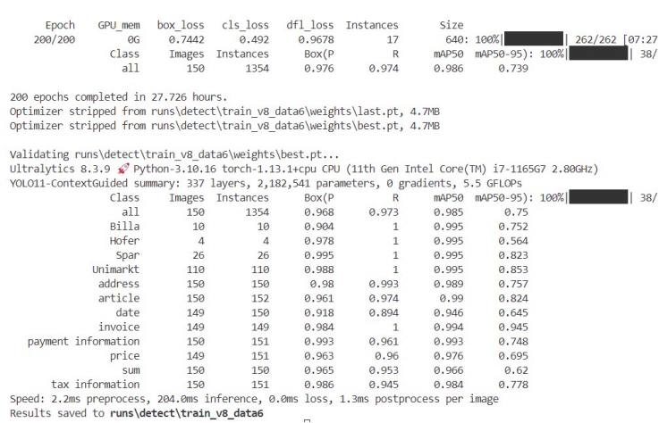
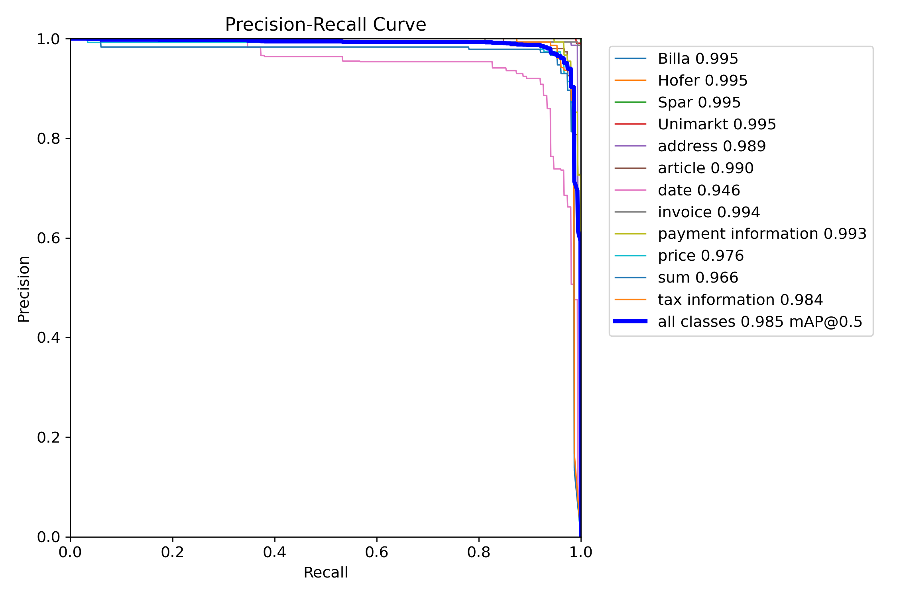
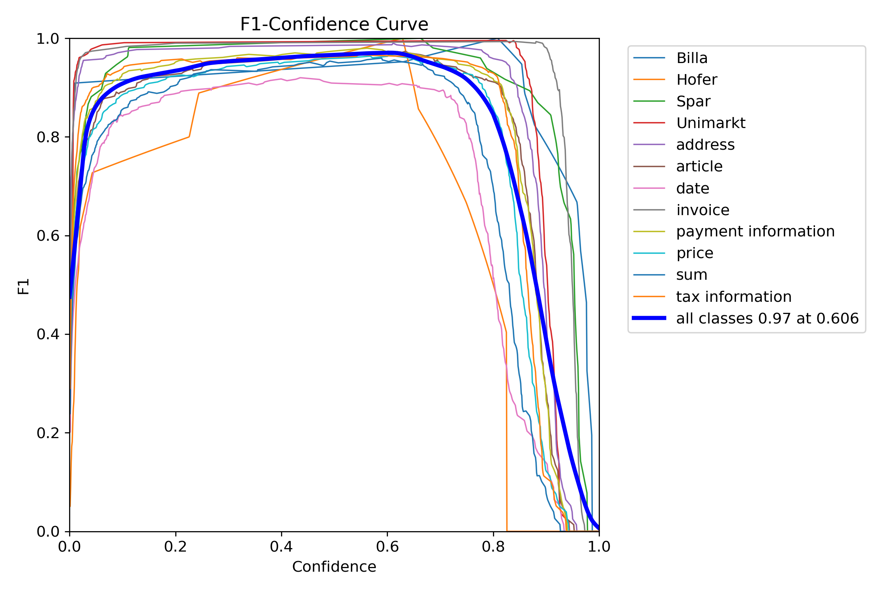
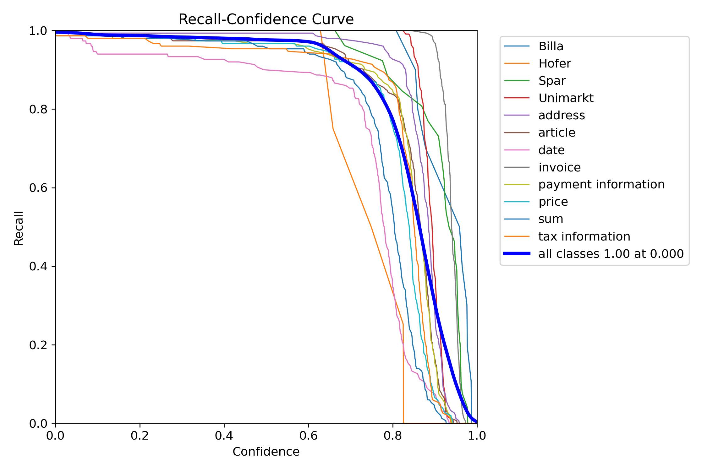

# Design-and-Implementation-of-Invoice-Information-Extraction-Algorithm-Based-on-Con-YOLO
This algorithm integrates the contextual guidance capability into the native YOLOv11 framework through an attention mechanism. It utilizes the attention mechanism to explore the correlations between features of different scales, enhances the feature representation of small targets and complex scenes

## 🌟 项目简介

本项目旨在实现高效、精准的发票关键信息提取。通过在YOLOv11主干网络中引入**Context Guide模块**，增强了模型对上下文信息的捕捉能力，有效解决了发票场景中因褶皱、污损、光照不均导致的信息提取困难。

### 核心改进
- **算法架构**：基于 **YOLOv11**，引入 **Context Guide** 注意力机制。
- **特征增强**：设计了 **FGLo模块**，通过全局平均池化和全连接层动态调整通道权重，增强关键特征表达。
- **轻量化设计**：在保持高精度的同时，通过深度可分离卷积降低计算复杂度，单张发票处理仅需 **0.8秒**。

# 🧾 Con-YOLO: 基于注意力机制的发票信息提取算法


## 📖 项目简介

本项目提出了一种改进的 YOLOv11 算法——**Con-YOLO**，旨在解决传统 OCR 方法在处理复杂、污损、倾斜发票时精确率低、速度慢的问题。通过引入 **Context Guide** 模块和 **FGLo** 通道注意力机制，模型能够更有效地捕捉上下文信息，增强对关键特征的提取能力。

**核心优势：**
*   **高精度**: 在自建发票数据集上，精确率达到 **96.8%**。
*   **高效率**: 单张发票处理时间缩短至 **0.8秒**。
*   **强鲁棒性**: 对褶皱、污损、旋转等复杂场景下的发票具有出色的识别能力。

## ✨ 核心改进

Con-YOLO 在原生 YOLOv11 的基础上进行了以下关键改进：

1.  **Context Guide 模块**:
    *   并行使用普通卷积和膨胀卷积，在不增加参数的情况下扩大感受野，同时捕捉局部特征和全局上下文信息。
    *   通过特征融合，使模型能更全面地理解发票的语义信息，尤其适用于格式多样的票据。

2.  **FGLo (Feature Global) 模块**:
    *   一种轻量级的通道注意力机制。通过全局平均池化和全连接层，动态学习每个通道的重要性权重。
    *   能够有效增强关键特征通道，抑制无关的背景噪声，提升模型在复杂场景下的特征表达能力。

## 📊 实验结果与性能对比

我们在包含 800 张多样化发票（商超小票、外卖单等）的数据集上进行了训练和评估。

### 详细评估指标

根据论文第4章实验分析，模型在验证集上的具体表现如下：

| 类别 (Class)       | 精确率 (P) | 召回率 (R) | mAP@50 |
| **Average (平均)** | **0.968** | **0.973** | **0.985** |
| Address           | 0.980     | 0.993     | 0.989     |
| Date             | 0.918     | 0.894     | 0.946     |
| Sum             | 0.965     | 0.953     | 0.966     |

### 模型性能对比

下表展示了 Con-YOLO 与原始 YOLOv11 及传统 Tesseract-OCR 算法的性能对比。

| 模型 | 平均精确率 (mAP) | 提升幅度 |
| :--- | :--- | :--- |
| **Con-YOLO (Ours)** | **96.8%** | **+4.8%** (vs YOLOv11) |
| YOLOv11 | 92.0% | - |
| Tesseract-OCR | 83.2% | - |

### 训练结果可视化

下图展示了模型训练过程中的终端输出结果，包含最终的损失值（Loss）、精确率、召回率及mAP指标：


*(图注：模型训练最终指标输出，mAP@50达到0.985)*


### 关键指标曲线分析

#### 1. 精确率-召回率曲线 (Precision-Recall Curve)

PR 曲线是衡量目标检测模型性能的核心指标，它反映了模型在不同置信度阈值下，精确率（Precision）和召回率（Recall）之间的权衡关系。

*   **曲线解读**: 曲线越靠近右上角（即精确率和召回率都接近 1.0），代表模型性能越好。
*   **本模型表现**: 如图所示，本模型的 PR 曲线（`all classes`）非常贴近右上角，mAP@0.5 达到了 **0.985**。这表明模型在保持极高精确率的同时，也能检测出绝大多数的真实目标，综合性能非常优异。



#### 2. F1-置信度曲线 (F1-Confidence Curve)

F1 分数是精确率和召回率的调和平均数，用于综合评估模型性能。该曲线展示了 F1 分数随置信度阈值变化的趋势。

*   **曲线解读**: 曲线的峰值点代表了模型的最佳工作点，即在该置信度下，模型的精确率和召回率达到了最佳平衡。
*   **本模型表现**: 如图所示，模型在置信度为 **0.606** 时，F1 分数达到了峰值 **0.97**。这证明模型具有极高的可靠性，能够在保证高查全率的同时，维持极低的误检率。



#### 3. 召回率-置信度曲线 (Recall-Confidence Curve)

该曲线反映了模型找出所有正样本的能力如何随置信度阈值变化。

*   **曲线解读**: 在低置信度时，召回率通常很高，因为模型会预测出大量边界框。随着置信度阈值提高，只有最确定的预测被保留，召回率会随之下降。
*   **本模型表现**: 如图所示，模型在很宽的置信度范围内都能保持接近 1.0 的召回率，直到置信度非常高时才开始下降。这说明模型对目标的“记忆”非常深刻，不易漏检。




## 🛠️ 环境配置

*   **操作系统**: Windows 11
*   **Python**: 3.10.16
*   **PyTorch**: 1.13.1+cpu
*   **CUDA**: 11.7 (如需GPU加速)
*   **其他依赖**: `ultralytics`, `opencv-python`, `matplotlib`, `PyQt5` 等。

**安装依赖:**
```bash
pip install -r requirements.txt

🚀 快速开始
1、训练模型
    运行 train.py脚本
    开始训练：
        python train.py
    训练完成后，最佳模型权重将保存在 runs/detect/.../weights/best.pt

2、运行可视化界面
    使用训练好的权重进行推理和可视化。
        python ui.py

如果本项目对您的研究有所帮助，请引用原论文：
叶曜诚. 基于Con-YOLO发票信息提取算法设计与实现[D]. 沈阳城市学院, 2025.
